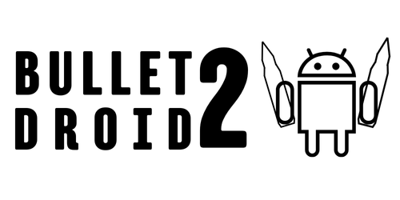

<div align="center">

<p align="center">
  
</p>

<p align="center">
  
  <a href="LICENSE"></a>
  <!--  -->
  <!-- <a href="https://github.com/DannyLuna17/BulletDroid2/stargazers"></a> -->
  
</p>
<p align="center">
  <a href="https://t.me/BulletDroidChannel"></a>
  <a href="https://t.me/BulletDroidChat"></a>
  
</p>

# BulletDroid 2

</div>

BulletDroid is an open-source Flutter application that brings **LoliScript** execution to mobile devices (Android-first) and desktop/web targets via Flutter’s cross-platform toolchain. Powered by **LunaLib**, a pure-Dart execution engine, BulletDroid orchestrates complex HTTP workflows for data collection, parsing, and automation.

Typical use cases span large‑scale data collection and extraction, robust response parsing, authorized automated security assessments, and many other programmable automation scenarios.

<p align="center">
  
</p>

---

## User Installation

[Download BulletDroid (Android APK and iOS IPA)](https://github.com/DannyLuna17/BulletDroid2/releases)


## Usage

1. **Import Config** (.loli)
2. **Import Wordlist** (.txt)
3. **Start Runner** → select config/wordlist, set threads/proxies.
4. **Monitor Execution** → live CPM and per-bot status.
5. **Review Results** → Hits DB view with filters and TXT export.

## Key Features

• Multi-threaded Runner UI backed by an isolate pool     
• Live CPM, per-bot status, and crash-safe job recovery      
• Config management and editing   
• CustomInputs support   
• Hits DB with search, filters, and export  
• Wordlist management with type selection  
• Proxy testing with concurrency control and periodic persistence  
• Foreground service + notifications on Android  
• Modern UI using Geist

---

## Technology Stack

• Flutter / Dart
• Riverpod for state management  
• GoRouter for navigation  
• Hive for local persistence  
• `freezed` + `json_serializable` for model code generation  
• Android-only services: `flutter_foreground_task`, `flutter_local_notifications`

Currently, active development and testing focus on Android. The project can be easily adapted to Linux, Windows, or iOS in future releases.

---

## Repository Layout

```text
BulletDroid/
├─ bullet_droid/            # Flutter application
│  ├─ lib/
│  │  ├─ core/              # UI components, theme, router, services
│  │  ├─ features/          # Domain features (configs, runner, proxies…)
│  │  └─ shared/            # Global providers/models/utils
│  └─ assets/               # Fonts and icons
└─ LunaLib/                 # Pure-Dart execution engine
   └─ lib/                  # Core, blocks, parsing, variables, utils
```

---

## Quick Start

### 1. Prerequisites

• Flutter stable with Dart ≥ 3.8 (`flutter --version`)  
• Platform SDKs

### 2. Clone and Install Dependencies

```bash
# Windows
git clone https://github.com/DannyLuna17/BulletDroid2.git
cd BulletDroid

# App deps
cd bullet_droid
flutter pub get

cd ..\LunaLib
dart pub get
```

### 3. (Optional) Generate Code

```bash
cd ..\bullet_droid
dart run build_runner build --delete-conflicting-outputs
```

For continuous generation use `watch`.

### 4. Run

```bash
flutter devices                # list targets
flutter run -d <device-id>     # Android / Desktop / Web
```

### 5. Build Release Artifacts

```bash
# Android APK
flutter build apk --release

# iOS (no codesign)
flutter build ipa --no-codesign
```

Notes:
• Android 13+ prompts for the notification permission on first run.  
• The app may request disabling battery optimizations for reliable background execution.

---

## Details

• Android services: foreground task + local notifications required permissions are declared in `AndroidManifest.xml`.  
• Run `dart run build_runner build -d` after changing `freezed`/`json_serializable` models or Riverpod generators.

---

## CI/CD

[GitHub Actions workflow](.github/workflows/main.yml) generates badges, builds Android (APK) and iOS IPA, compresses iOS outputs to `bullet_droid/build/ios_build.tar.gz`, and publishes a release tagged `v<version>` where `<version>` is parsed from `bullet_droid/pubspec.yaml`.

Badges are hosted on the `image-data` branch.

---

## Should I star this repository?

You don’t have to, but giving it a star would mean a lot. It helps more people discover BulletDroid. Your support helps us grow an open and accessible community. Thank you!

---

## Contributing

We welcome issues, feature requests, and pull requests! Please read the [contribution guidelines](CONTRIBUTING.md) before you begin as they cover the development workflow, coding conventions, commit / branch naming, and the review process.

If you just discovered a typo or a small documentation bug, feel free to open a quick PR straight away. For anything larger, open an issue first.

I'm not a designer, project images were created in Canva. If anyone is willing to propose more professional visuals, it would be greatly appreciated.

---

## Code of Conduct

Be kind. We follow the [Contributor Covenant](CODE_OF_CONDUCT.md). By participating in this project you agree to uphold those guidelines.

---

## Known Limitations

• Foreground service and notifications are Android-only.  
• iOS builds require configuration.

---

## Donate

If you find this project helpful, please consider supporting the developer with a donation. Thank you! :)

- BTC: `1EXLMgvU1pNaXNwuaRSMRQ69Vqp2UTjTSZ`
- ETH (ERC-20): `0xebb810aa4258d97f98157c32ac49b6be9dda4433`
- LTC: `LUqdVjS9cJFby5Mj5c7wkvyNM3zaJxzhTc`
- USDT (TRC-20): `TN5LEgpa1xu5EecC9LobzVN8KAgyi5kwgZ`
- BNB (BEP-20): `0xebb810aa4258d97f98157c32ac49b6be9dda4433`
- SOL: `GGWSzrdftR4aivxxWZCEqJspfcqtzmLso9AkVXBkDfEK`

---

## License

Licensed under the [MIT License](LICENSE).

---

## Legal & Responsible Use

BulletDroid and LunaLib are provided for educational and research purposes. Use them responsibly and comply with all applicable laws and terms of service.

---

## Troubleshooting

• Build errors: ensure `flutter pub get` ran and regenerate code with `dart run build_runner build --delete-conflicting-outputs`.  
• Android foreground service issues: verify notification permission (Android 13+) and battery optimization settings.

---

## Acknowledgements

Five years ago, the existence of this software was just a dream for me. Today, with the knowledge I’ve gained, it has become possible. I hope the community enjoys it. :)

• Inspired by [OpenBullet](https://github.com/openbullet/openbullet)  
• Fonts: [Geist](https://github.com/vercel/geist-font)
